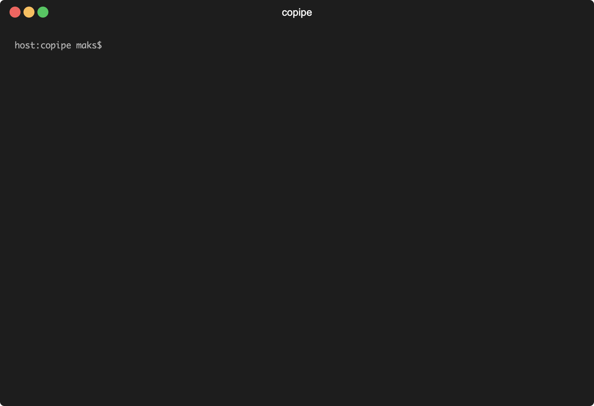

# Copipe

Copipe is a tool for running a chain of containers with predefined commands. Configuration is defined in the `.copipe.yaml` file, allowing you to start the tool with a single command: `copipe`.



## Installation

Currently, installation is only possible using binaries. Follow these steps for installation:

1. Open the [Releases Page](https://github.com/mboldysh/copipe/releases)
2. Select the desired release version
3. Execute the code snippet below using the chosen release version and target OS

```bash
# Specify the Copipe version you want to install
export COPIPE_VERSION=0.1.0

# Specify OS and Architecture
export COPIPE_OS="darwin_amd64"

# Donwload and install Copipe binary
curl -fSL "https://github.com/mboldysh/copipe/releases/download/${COPIPE_VERSION}/copipe_${COPIPE_VERSION}_${COPIPE_OS}.tar.gz" -o copipe.tar.gz \
  && tar -xf copipe.tar.gz \
  && mv copipe /usr/local/bin/copipe \
  && chmod a+x "/usr/local/bin/copipe" \
  && rm -f copipe.tar.gz
```

## Usage

In order to launch Copipe, the .copipe.yaml file should be set up. The directory where this file is placed will be identified by Copipe as the working directory inside containers. This file stores steps where each step represents container configuration that will be executed. Currently, Copipe supports following properties for step:

* `image` - image to use for the step
* `name` - name of the step (used as part of the container name)
* `script` - list of commands to be executed in the container

Here is an example of `.copipe.yaml` that will first build Go application in one container and then execute a lint check using golangci-lint in another:

```yaml
steps: 
  - image: "golang:1.21.6"
    name: build
    script: 
      - go build .
  - image: "docker/golangci-lint:1.55.1-go1.21.6"
    name: lint
    script:
      - golangci-lint help linters
      - golangci-lint run
```